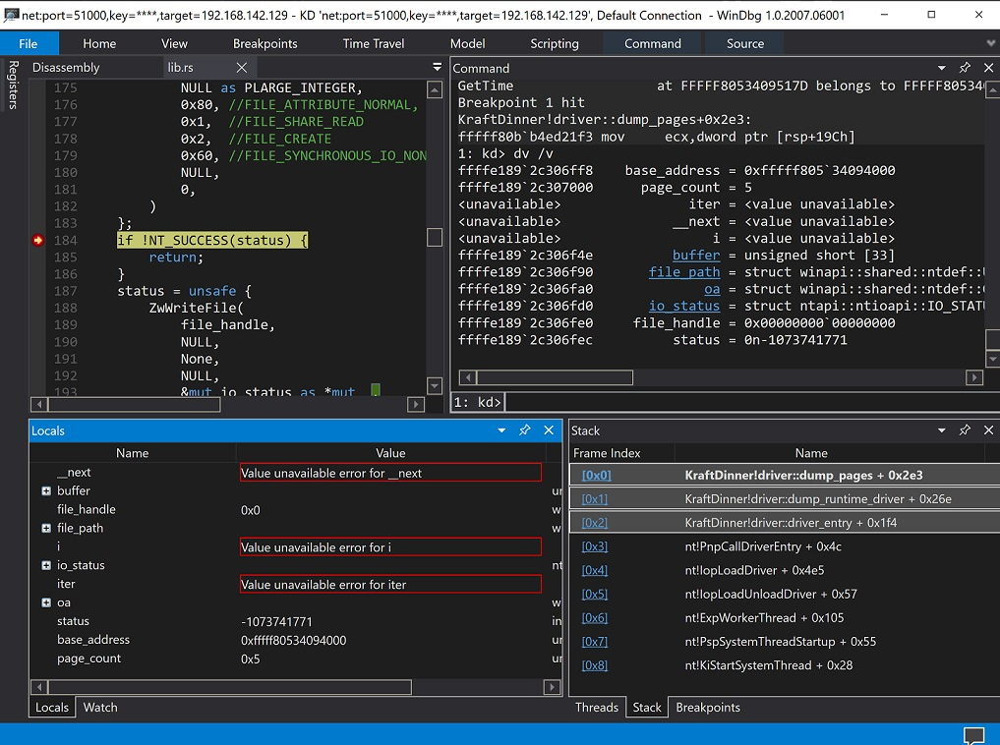

# kraft_dinner
An experimental Windows kernel-mode driver that extracts certain runtime drivers, written in Rust.

## Building

On the system that can already build Windows drivers with Visual Studio and WDK,
run the below command to build the Debug version of the driver.
```
> cargo make sign
```

For Release build, do this.
```
> cargo make sign --profile production
```

Debugging can be done as normally do with C/C++ based drivers.


## Acknowledgement

This driver is based on [kernel-driver-with-rust](https://github.com/not-matthias/kernel-driver-with-rust) by @not-matthias. Those are are interested in writing windows drivers in Rust should read his/her posts.

### Changes

Here are primary changes from the his/her work
- `.cargo/config` was changed to embed the full path to PDB file, as Visual Studio normally does
- removed dependency on forked, unmaintained `winapi`, and used `ntapi` instead
- removed some non-essential dependencies, or switched to more popular alternative
- switched to `DbgPrintEx` from `DbgPrint` for `!log` implementation
